# SharePal

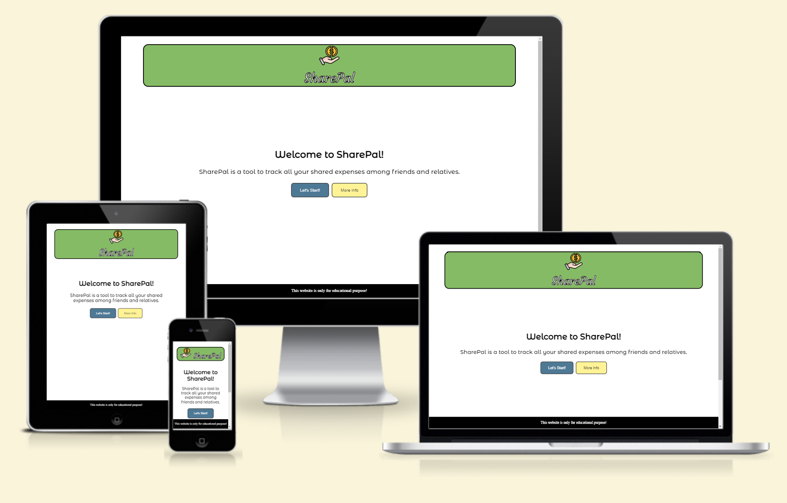

This project is one of my five portfolio projects. This project is based on HTML, CSS and JavaScript. The project is made with two friends or roommates in mind who often fund joint expenses and want an equal share of it at the end of the month. This project offers its users to add two usernames/payers, the reason for the payment and the amount. As each expense is added, the final balance is displayed, detailing who owes how much money.

A live version of the project can be found here:
[Project 2](https://zeeshan-shah.github.io/pp2/)

---

## Table of Content

* [User Experience](#user-experience)
    - [User Stories](#user-stories)
    - [User Goals](#user-goals)
    - [Requirements](#requirements)
* [Design](#design)
    - [Colour Scheme](#colour-scheme)
    - [Typography](#typography)
    - [Images](#images)
* [Features](#features)
    - [The Header](#the-header)
    - [Main Section](#main-section)
    - [The Footer](#the-footer)
* [Technologies Used](#technologies-used)
* [Testing](#testing)
    - [W3C Validator](#w3c-validator)
        + [HTML Validation](#html-validation)
        + [CSS Validation](#css-validation)
    - [Lighthouse](#lighthouse)
        + [Lighthouse Test](#lighthouse-test)
* [Development and Deployment](#development-and-deployment)
    - [Development](#development)
    - [Deployment](#deployment)
* [Credits](#credits)
    - [Content](#content)
    - [Acknowledgments](#acknowledgments)
    - [Useful Sources](#useful-sources)

---

## User Experience

### User Stories

#### Users

* Add my name and the name of my friend/flatmate.
* Add the reason of the payment.
* Add amount that has been paid.

### User Goals

* Find out who owes and how much at the end of the month or after a certain period of time. 

### Requirements

* A responsive website. 
* Accesibility.
* Easy to handle and perform functions with few buttons.
* Visually appealing design and layout on any screen size.

---

## Design

### Colour Scheme

I wanted to choose the color that would reflect the color of the green dollar bill. Different colors were used for the different payers in order to be able to better distinguish the expenses in the expense entry.
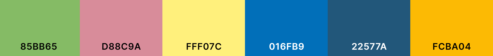

The colour palette was created using [Coolors](https://coolors.co/).

### Typography

Google Fonts was used to import the chosen fonts for use in the site.

I have selected multiple fonts for my project. I used the courgette font for my logo. This font gives my logo an extra eye-catching style. I used Montserrat Alternates for my headlines. I chose Sacramento for the expense report. Sacramento gives the record the impression of being handwritten.

### Images

The logo icon was chosen appropriately to clarify the distribution of the expenses. The add icon has been used to allow users to add their expenses efficiently.

Images have been resized to fit the theme and changed to .webp format for better site performance.

---

## Features

The website consists of a header, main section and a footer.

### The Header

The Header contains a logo and a heading.

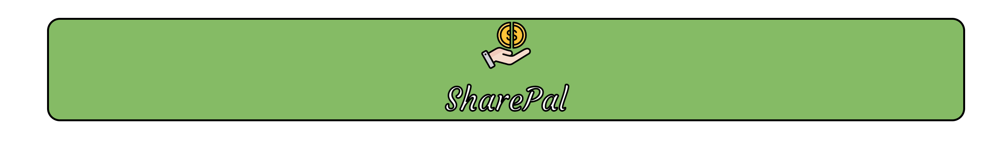

### Main Section

The main section consists of small sections. It contains all the important functions of the website. It shows the welcome message, the "Let's Start" button, which allows users to enter their name. After submitting their details, this will take you to the screen that mentions adding their expenses and an "Add" button. By clicking the "Add" button, they can easily add the details of the expense and the amount paid. Each expense added calculates the other person's share and states who owes how much at the bottom of the page.

Welcome text is displayed
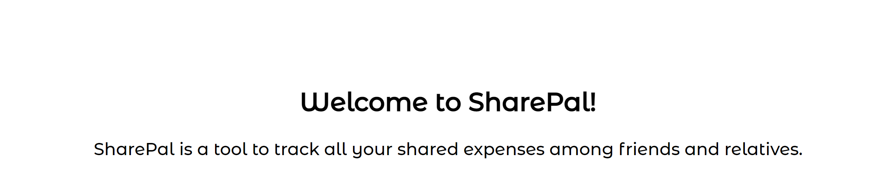
Let's Start button allows user to start the entering user data. 
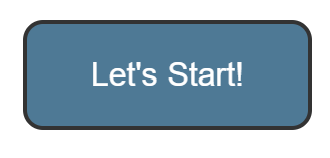

Username window contain window with input field to enter usernames.
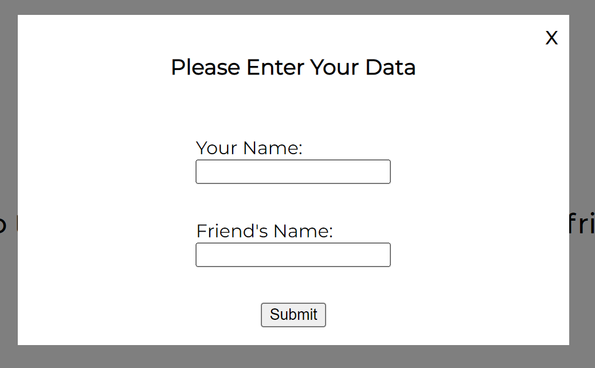
If any username input is left blank and submitted, a warning will be displayed.
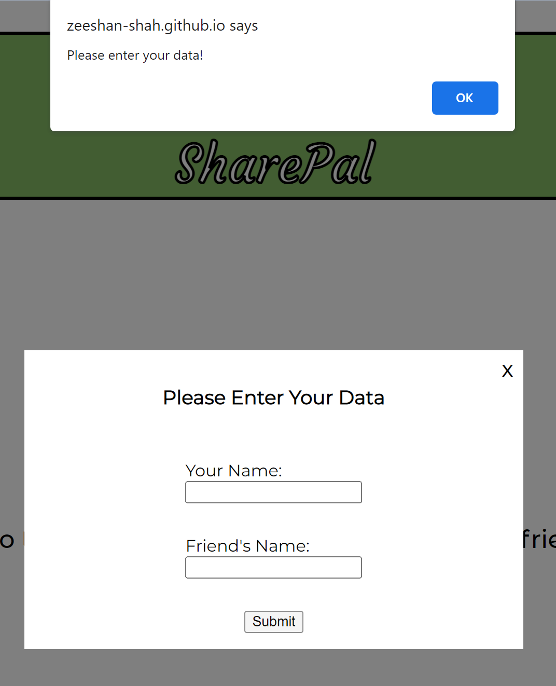
The "More Information" button gives a brief overview of the functionality of the website.

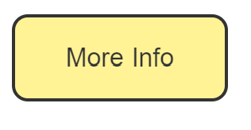

The window contains a brief guide on how to use this application.
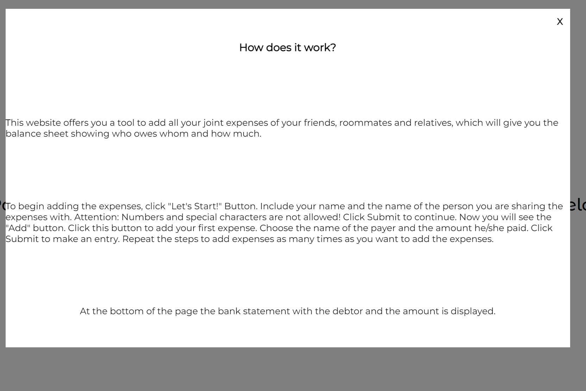
Add expense text is displayed.
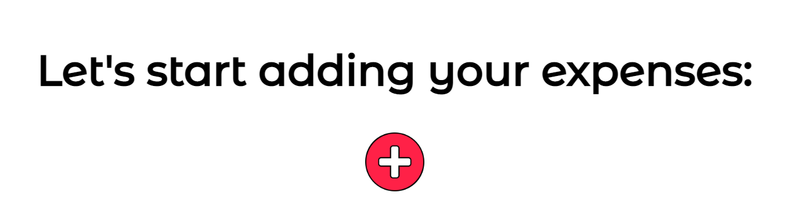
The usernames entered in the previous step will be displayed here as a selection down to select the payer. User will be asked to add payment details(reason for the payment) and the amount paid.
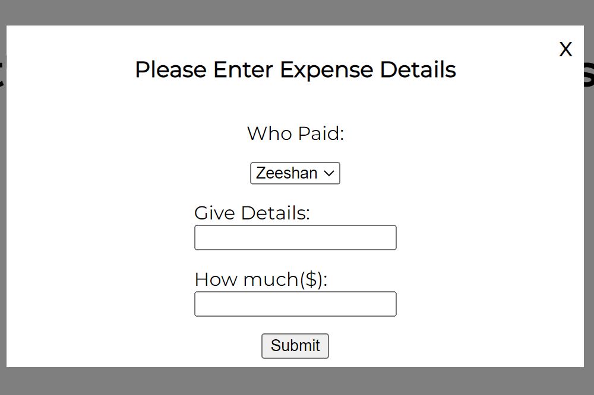
If the user submitted the form without the payment details, a warning will be displayed.
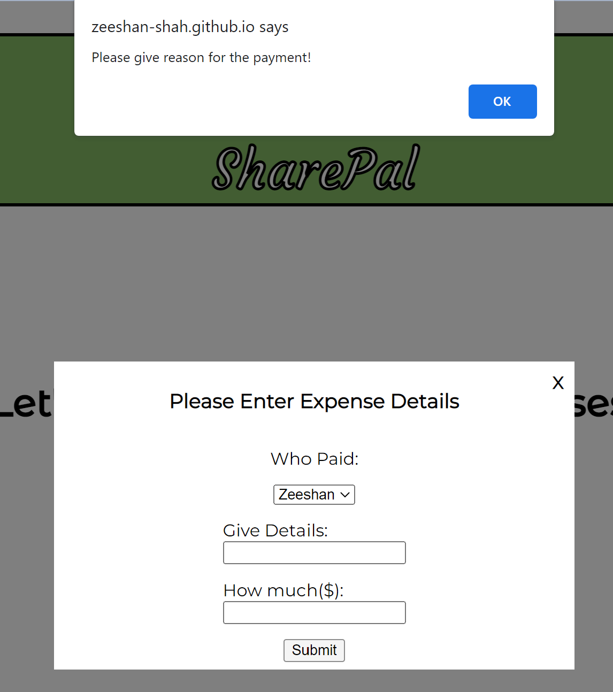
Likewise, a warning will be displayed if the user submits the form without the amount.
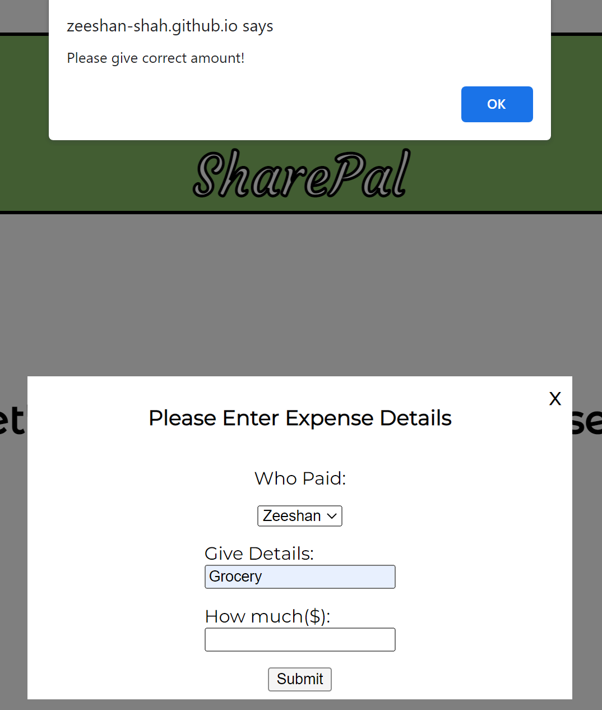
After submitting the form, the entered data will be displayed on the screen. Example 1:
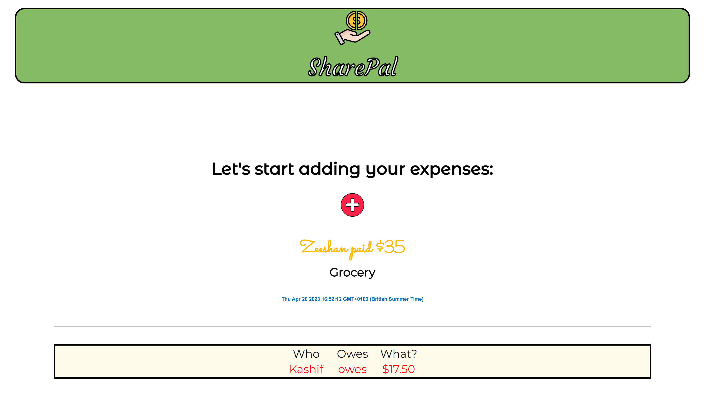
Example 2:
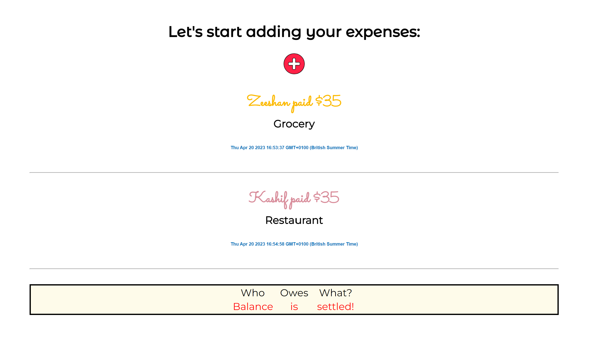
A statement showing who owes what is displayed in a box at the bottom of the page. Example 1:
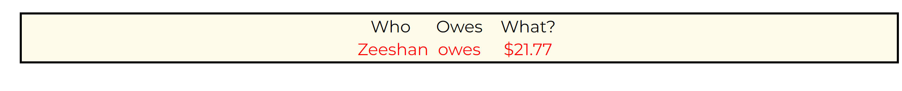
Example 2:
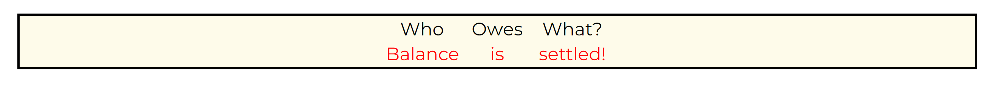

### The Footer

The footer is fixed on the screen. There is a disclaimer that the site is for educational purposes only.

## Technologies Used

* HTML 
* CSS
* Javascript

---

## Testing

Testing continued throughout the development of the site. During development I used Google developement tool to make sure everything was working properly and to help troubleshoot when things weren't working as expected. The console also played an important role in finding the errors in my JavaScript.

I ensure through chrome development tool that my website is responsive on a variety of different screen sizes and devices.

### W3C Validator

#### HTML Validation

[HTML Validator](https://validator.w3.org/nu/?doc=https%3A%2F%2Fzeeshan-shah.github.io%2Fpp2%2F)

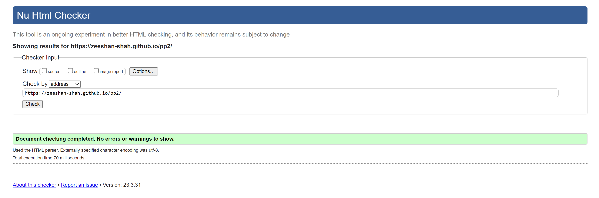

#### CSS Validation

[CSS Validator](https://jigsaw.w3.org/css-validator/validator?uri=https%3A%2F%2Fzeeshan-shah.github.io%2Fpp2%2F&profile=css3svg&usermedium=all&warning=1&vextwarning=&lang=en)

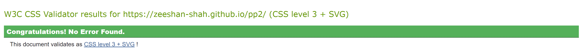

#### JavaScript Validation

No major errors were found in the JavaScript.

### Lighthouse

#### Lighthouse Test 

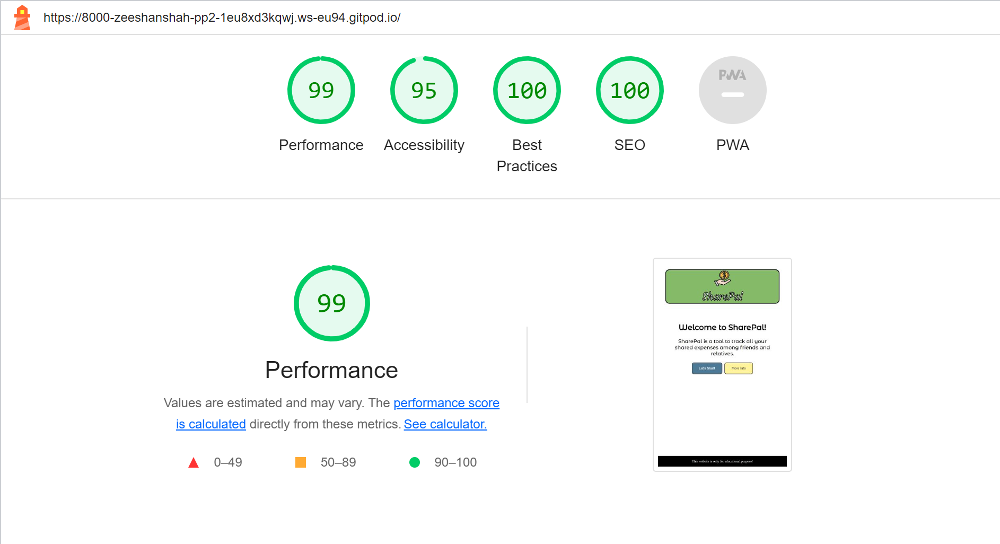

---

## Development and Deployment

### Development

The development of this project started with a thought process and some rough sketches of the structure of my website.

* Sketch of the website:

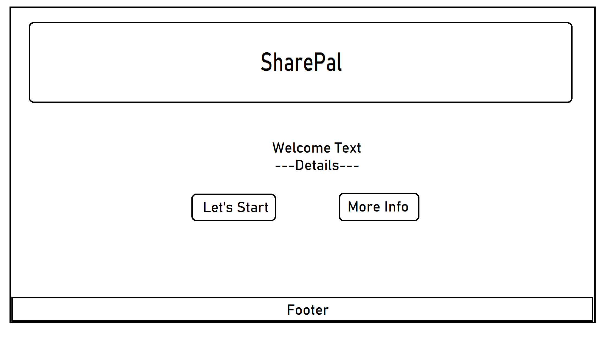

#### Deployment

The site is deployed using GitHub Pages.

The procedure for deployment followed the "Creating your site" steps provided in [GitHub Docs](https://docs.github.com/en/pages/getting-started-with-github-pages/creating-a-github-pages-site).

1. Login or Sign Up to GitHub.
2. Open the project repository.
3. Open the project repository.
4. Click on "Pages" in the left hand navigation panel.
5. At the "Source" section choose "main" as Branch and root as folder and click "Save".
6. The website will be deployed in few minutes and the page URL will be displayed above "Source".

---

## Credits

### Content

* Icons used in the project were taken from the external source.
    - [Icons](https://www.flaticon.com/search/2?word=menu&color=color)

* The keywords were taken from the following sources.
    - [Twin Word](https://www.twinword.com/ideas)
    - [SEO Explorer](https://seo-explorer.io)

### Acknowledgments

I would like to thank the following people:

Lauren-Nicole

* My helpful mentor at Code Institute who was always there to offer useful tips and constructive feedback.

Ed

* Tutor: Thank you for your help in fixing bugs in my code.

### Useful Sources

Websites that have provided me with information and assistance beneficial to this project:

* [W3C Schools](https://www.w3schools.com/)
* [CSS Tricks](https://css-tricks.com/snippets/css/a-guide-to-flexbox/)

The top screenshot in this ReadMe was created with:

* [Am I Responsive](https://ui.dev/amiresponsive)

Best regards,

[SharePal](https://zeeshan-shah.github.io/pp2/)